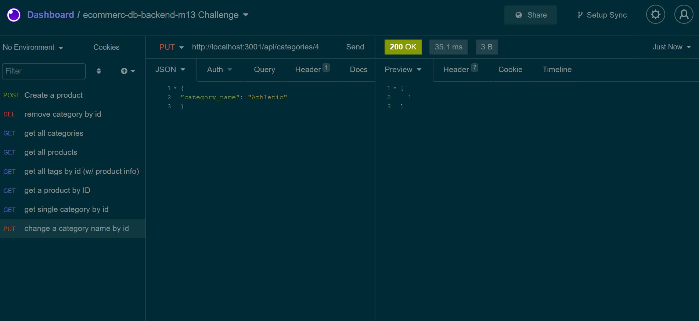
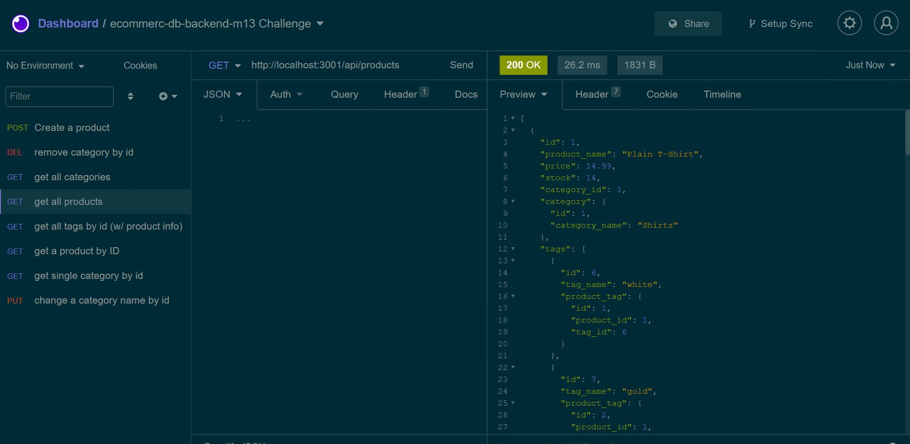
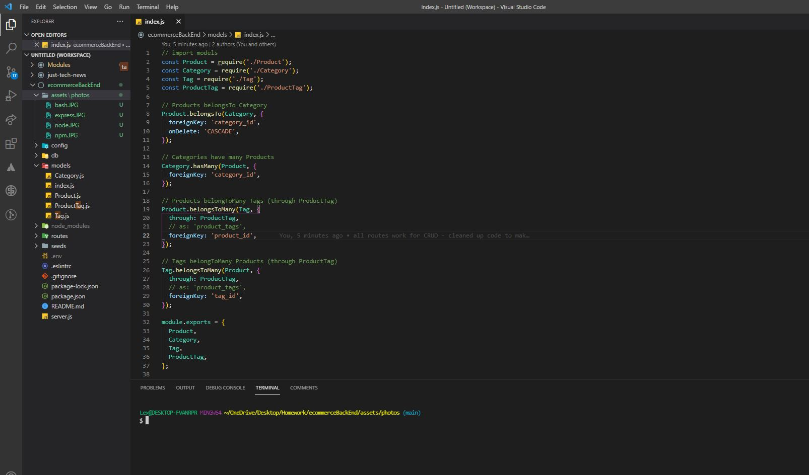
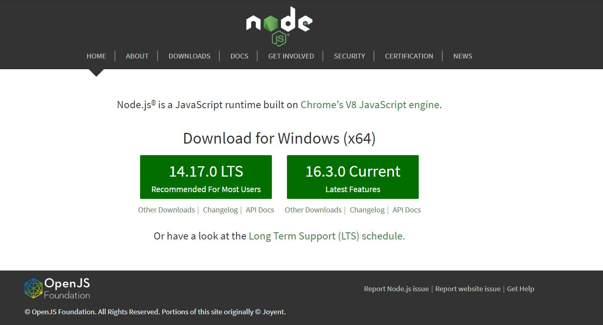
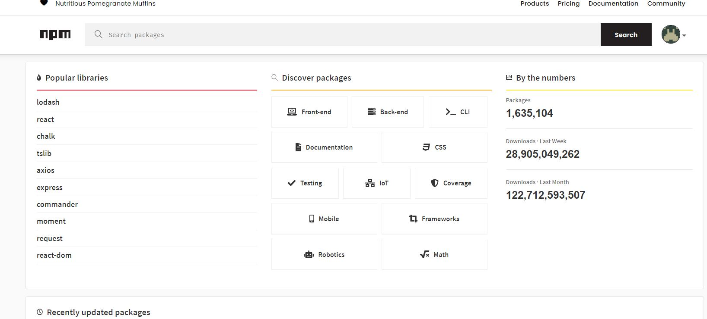
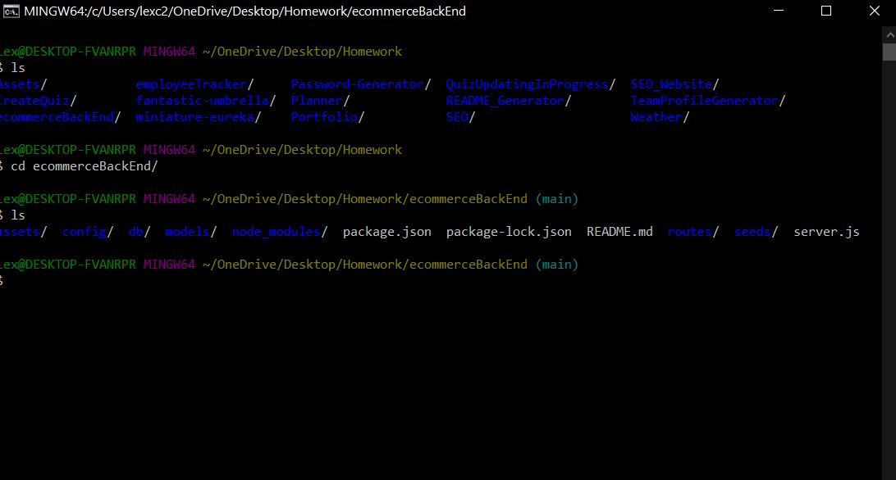

# E-commerce Backend

#### Table of Contents

- [About](#About)
- [Installation](#Installation)
- [Usage](#Usage)
- [Contribution](#Contribution)
- [License](#License)

# About
The E-Commerce Application was created to build the backend of an e-commerce site using RESTful API practices. These practices included what's most commonly known as "CRUD", which stands for Create, Read, Update, and Delete. 

User Story:
AS A manager at an internet retail company
I WANT a back end for my e-commerce website that uses the latest technologies
SO THAT my company can compete with other e-commerce companies

The E-Commerce App was created using [Visual Studio Code](https://code.visualstudio.com/), [Node.js](https://nodejs.org/en/), [Node Package Manager (npm)](https://www.npmjs.com/), [mySQL](https://www.mysql.com/), [Sequelize](https://www.npmjs.com/package/sequelize), [MySQL2](https://www.npmjs.com/package/mysql2) and [Express](https://expressjs.com/).
Please visit [this video](https://drive.google.com/file/d/1-yb649J4fDiidk4TjB0Ra4NZUzuZMN7O/view?usp=sharing) for a live demonstration, since application is not deployed, due to this being a backend task.

# Installation

To install please visit [my repository](https://github.com/lexcraw4d/ecommerce-back-end) and look at the uploaded files via GitHub Deployment. You may fork my repository and download [Node.js](https://nodejs.org/en/) Additionally, you will need [Visual Studio Code](https://code.visualstudio.com/), [npm](https://www.npmjs.com/), and [Express](https://www.npmjs.com/package/express).The details of how to implement these are provided in the [Usage](#Usage) section below.

# Usage

##### Visual Studio Code

Visual Studio Code (VS) was used to create, edit, and code the Team Profile Generator.

[Visual Studio Code](https://code.visualstudio.com/) is an lightning fast FREE open-source editor designed by [Microsoft](https://www.microsoft.com/en-us/) with developers in mind. Visual Studio code allows developers to easily apply the edit-build-debug cycle, resulting in more productivity on your ideas.

[Visual Studio Code](https://code.visualstudio.com/) brings all that you need as a developer, such as: debugging, instant editing results, customization specifically designed for your preference, hundreds of languages, extensions, version control, and more all at your fingertips!

### Node.js

Node.js was used in combination with VSC. Node.js allows the user to interact with the command line interface instead of the window object. You can download Node [here](https://nodejs.org/en/).

### npm and Express

[npm](https://www.npmjs.com/package/inquirer) was used in combination with [Express](https://expressjs.com/) to create a backend middleware server. Express is a flexible Node.js application frameworke that provides many features available for both mobile and the web. Please click the referenced information for documentation on npm and Express. In addition, you will need to run npm install for the dependencies MySQL2 and Sequelize. 

### Directions
To run the E-Commerce  please fork my repository and open your CLI terminal. You will need to run mysql from the CLI and use the ecommerce_db. Next (or if you choose to skip the first step), you will type "npm run seed" into the CLI and press enter. After the seeded schema is completed, you will now type "npm start" to start the server. From there, use either Insomnia Core or Postman and make CRUD RESTful API requests to the endpoints found in the video walkthrough.

✨Wahlah! That's it!✨
Now you have a functional backend server up and running for your e-commerce site! ✅🔥

#### GitHub/Git

In order to make effective changes to the website both [Git](https://gitforwindows.org/) and [GitHub](https://github.com/) were used in synchronization to push commits of the latest updated version.

Git is version control system which allows multiple users to make changes to one single repository.

GitHub is a corporation which provides hosting for version control using Git and software development. [GitHub Docs ](https://docs.github.com/en/free-pro-team@latest/github/setting-up-and-managing-your-github-user-account/managing-user-account-settings) provides all needs for setting up your GitHub and answering problem-solving issues you may come across while using GitHub.

# Contribution

Feel free to contribute to this project in any of the following ways:

- [Submit bug and feature requests](https://github.com/lexcraw4d/ecommerce-back-end/issues)
- [Review Source Code Changes](https://github.com/lexcraw4d/ecommerce-back-end/pulls) and make pull requests from typos to content
- For specific concerns that do not meet the above please do not hesitate to reach out to me via [My GitHub](https://github.com/lexcraw4d).

If you are interested in fixing issues directly to the code base, please reference the [How to Contribute](https://github.com/microsoft/vscode/wiki/How-to-Contribute) article.

# License

This source code is available to everyone under the standard [MIT License](https://github.com/microsoft/vscode/blob/master/LICENSE.txt).

:copyright: 2021 Lexie Crawford :computer: :heart:
